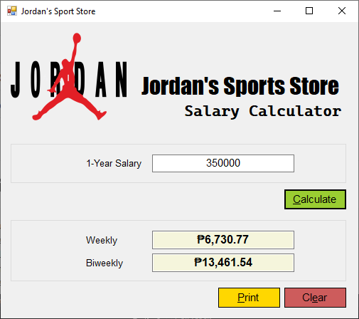

# Week 2: Let's Analyze (Activity 2b)

<p align="center">
  
</p>

\* | Name |
--- | ---
Project | **prjJordanSportsShop_Luchavez**
App | **Jordan's Sports Store**

## Events

### ...when user clicks *Calculate* button
```
Private Sub btnCalculate_Click(sender As Object, e As EventArgs) Handles btnCalculate.Click
        Dim wholeSalary As Decimal = Val(txtYearlySalary.Text)
        Dim weeklySalary As Decimal = wholeSalary / 52
        Dim biweeklySalary As Decimal = wholeSalary / 26
        txtWeeklySalary.Text = FormatCurrency(weeklySalary, 2)
        txtBiweeklySalary.Text = FormatCurrency(biweeklySalary, 2)
End Sub
```

### ...when user clicks *Print* button
```
Private Sub btnPrint_Click(sender As Object, e As EventArgs) Handles btnPrint.Click
        btnCalculate.Hide()
        btnPrint.Hide()
        btnClear.Hide()
        printMain.Print()
        btnCalculate.Show()
        btnPrint.Show()
        btnClear.Show()
End Sub
```

### ...when user clicks *Clear* button
```
Private Sub btnClear_Click(sender As Object, e As EventArgs) Handles btnClear.Click
        txtYearlySalary.Clear()
        txtWeeklySalary.Clear()
        txtBiweeklySalary.Clear()
        txtYearlySalary.Focus()
End Sub
```